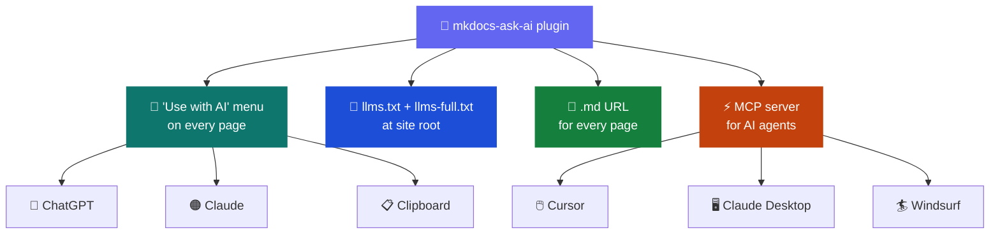

# 🤖 mkdocs-ask-ai

> Make your MkDocs documentation AI-ready — one plugin, every interface AI tools expect.
>
> Package: `mkdocs-ask-ai` · [PyPI](https://pypi.org/project/mkdocs-ask-ai/) · [GitHub](https://github.com/your-org/mkdocs-ask-ai)

[](https://pypi.org/project/mkdocs-ask-ai/)
[](https://pypi.org/project/mkdocs-ask-ai/)
[](https://pypi.org/project/mkdocs-ask-ai/)
[](LICENSE)
[](https://www.mkdocs.org)
[](https://squidfunk.github.io/mkdocs-material/)
[](https://modelcontextprotocol.io/)
[](https://llmstxt.org/)

| | Feature | What you get |
|---|---------|--------------|
| 🤖 | **"Use with AI" menu** | Floating dropdown on every page — copy, view, or open directly in ChatGPT or Claude |
| 📄 | **llms.txt + llms-full.txt** | AI crawler index and full-context file at your site root |
| 🔗 | **Markdown URLs** | Every page served as clean `.md` alongside its HTML |
| ⚡ | **MCP server** | AI agents query your docs programmatically via stdio or HTTP |
| 🌍 | **i18n support** | Full multilingual support via `mkdocs-static-i18n` |

https://github.com/user-attachments/assets/b6a26956-c54c-4fcb-9d59-e58626a37786

---

## 🗺️ Architecture



---

## ⚡ Quick Start

```bash
# 📦 base install
pip install mkdocs-ask-ai

# ⚡ with MCP server support
pip install mkdocs-ask-ai[mcp]
```

Add to your `mkdocs.yml`:

```yaml
plugins:
  - ask-ai:
      sections:
        "Getting Started":
          - index.md: "Introduction"       # explicit path + description
          - quickstart.md: "Quick start"
        "API Reference":
          - api/*.md                        # glob — include all matching files
```

That's it. Your site now has:

- 🤖 **"Use with AI"** dropdown on every page
- 📄 `llms.txt` and `llms-full.txt` at the site root
- 🔗 A `.md` URL for every page

---

## ✨ Features

### 🤖 "Use with AI" Dropdown

A floating button on every page with:

- 📋 **Copy page as Markdown** — one-click clipboard copy for any AI tool
- 👁️ **View as Markdown** — opens the clean `.md` source in a new tab
- 💬 **Open in ChatGPT / Open in Claude** — fetches the full page markdown and sends it directly into the chat, not a link; works on private or uncrawlable sites; pages over 7,500 characters are truncated with a link to the full `.md` source
- 📄 **llms.txt** — link to the full documentation index

Adapts to light and dark themes automatically. Inspired by [1Password's developer docs](https://developer.1password.com).

### 📄 llms.txt + llms-full.txt

Follows the [llms.txt standard](https://llmstxt.org/) to make your documentation discoverable by AI systems:

| | File | Purpose |
|---|------|---------|
| 🗂️ | **`llms.txt`** | Structured index with sections, titles, and links to markdown sources |
| 📚 | **`llms-full.txt`** | Complete documentation in a single file for full-context queries |

### 🔗 Direct Markdown Serving

Every page is accessible as clean markdown at its `.md` URL — no HTML parsing needed:

```
https://your-site.com/getting-started/index.md
```

### ⚡ MCP Server

Expose your docs as an [MCP](https://modelcontextprotocol.io/) server so AI agents can query them programmatically.

**Tools:**

| Tool | Description |
|------|-------------|
| `list_pages(locale?)` | 🗂️ Discover available pages grouped by section |
| `get_page(path, locale?)` | 📖 Fetch a specific page as markdown |
| `search_docs(query, locale?)` | 🔍 Full-text search with snippets |
| `get_full_docs(locale?)` | 📚 Get the entire documentation as one text |

**Transports:**

| Transport | Use case |
|-----------|----------|
| `stdio` | 🖥️ Local tools — Claude Desktop, Cursor, Windsurf |
| `sse` / `http` | 🌐 Public websites — `https://your-site.com/mcp` |

Every page is also registered as an MCP resource (`docs://site-name/path/to/page.md`).

### 🌍 i18n Support

Full support for multilingual sites via `mkdocs-static-i18n`. Each locale gets its own `llms.txt`, `llms-full.txt`, markdown URLs, and MCP tools with a `locale` parameter.

---

## ⚙️ Configuration

### 🗂️ Basic Options

```yaml
plugins:
  - ask-ai:
      sections: {}                      # section names mapped to file patterns
      markdown_description: ""          # description included in llms.txt header
      enable_ai_menu: true              # show "Use with AI" dropdown
      ai_menu_button_text: "Use with AI"
      enable_chatgpt: true              # show "Open in ChatGPT" item
      enable_claude: true               # show "Open in Claude" item
      enable_markdown_urls: true        # serve .md files alongside HTML
      enable_llms_txt: true             # generate llms.txt
      enable_llms_full: true            # generate llms-full.txt
```

### ⚡ MCP Options

```yaml
plugins:
  - ask-ai:
      enable_mcp: true                  # enable MCP server + docs-index.json
      mcp_path: "/mcp"                  # URL path for streamable HTTP
      mcp_port: 8808                    # port for MCP HTTP server
```

### 🌐 Section Patterns

Sections support explicit paths, descriptions, and glob patterns:

```yaml
sections:
  "Infrastructure":
    - infrastructure/index.md: "Infrastructure overview"   # explicit + description
    - infrastructure/proxmox.md: "Proxmox hypervisor"
    - infrastructure/*.md                                  # glob
  "API":
    - api/*.md
```

---

## 🔌 MCP Server Setup

### 🛠️ With `mkdocs serve` (development)

When `enable_mcp: true` is set, the MCP server starts automatically alongside the dev server at `http://127.0.0.1:8808/mcp`. Add to your `.mcp.json` or Claude Desktop config:

```json
{
  "mcpServers": {
    "my-docs": {
      "type": "sse",
      "url": "http://127.0.0.1:8808/sse"
    }
  }
}
```

### 🖥️ With Claude Desktop / Cursor (stdio)

Build your site first, then point to the output directory:

```json
{
  "mcpServers": {
    "my-docs": {
      "command": "mkdocs-ask-ai",
      "args": ["mcp", "--site-dir", "./public"]
    }
  }
}
```

> [!NOTE]
> If `mkdocs-ask-ai` is installed in a virtualenv, use the full path to the binary (e.g. `/path/to/.venv/bin/mkdocs-ask-ai`).

### 🌐 Standalone HTTP Server

```bash
# serve built site over HTTP
mkdocs-ask-ai mcp --transport http --port 8808 --site-dir ./public
```

### 📋 CLI Reference

```
mkdocs-ask-ai mcp [OPTIONS]

  --site-dir PATH              Built site directory (default: ./public)
  --transport {stdio,http,sse} Transport type (default: stdio)
  --port PORT                  HTTP/SSE port (default: 8808)
  --host HOST                  HTTP/SSE host (default: 127.0.0.1)
```

### 🚀 Deployment Matrix

| Deployment | MCP support |
|------------|-------------|
| `mkdocs serve` | ✅ Automatic — starts alongside dev server |
| Self-hosted (Docker / VM) | ✅ Run `mkdocs-ask-ai mcp` as a sidecar |
| Static hosting (GitHub Pages, GitLab Pages, Netlify) | ❌ Requires a running process |

> [!IMPORTANT]
> For static hosting, the "Use with AI" dropdown, `llms.txt`, and `.md` URLs all work out of the box. Only the MCP server requires a running process.

### 🌍 With mkdocs-static-i18n

Place `ask-ai` **before** `i18n` in the plugins list:

```yaml
plugins:
  - ask-ai:                   # must come first
      sections:
        "Docs":
          - "*.md"
  - i18n:
      docs_structure: suffix
      languages:
        - locale: en
          default: true
          name: English
        - locale: fr
          name: French
```

Output per locale:

```
public/
  llms.txt              # 🇬🇧 English index
  llms-full.txt         # 🇬🇧 full English docs
  docs-index.json       # 🌍 merged index (all locales)
  fr/
    llms.txt            # 🇫🇷 French index
    llms-full.txt       # 🇫🇷 full French docs
```

> [!TIP]
> `docs-index.json` always contains all locales merged — use it to power the MCP server across languages from a single file.

---

## 📜 License

MIT — see [LICENSE](LICENSE).

Originally inspired by [mkdocs-llmstxt-md](https://github.com/noklam/mkdocs-llmstxt-md) by Nok Lam Chan.
